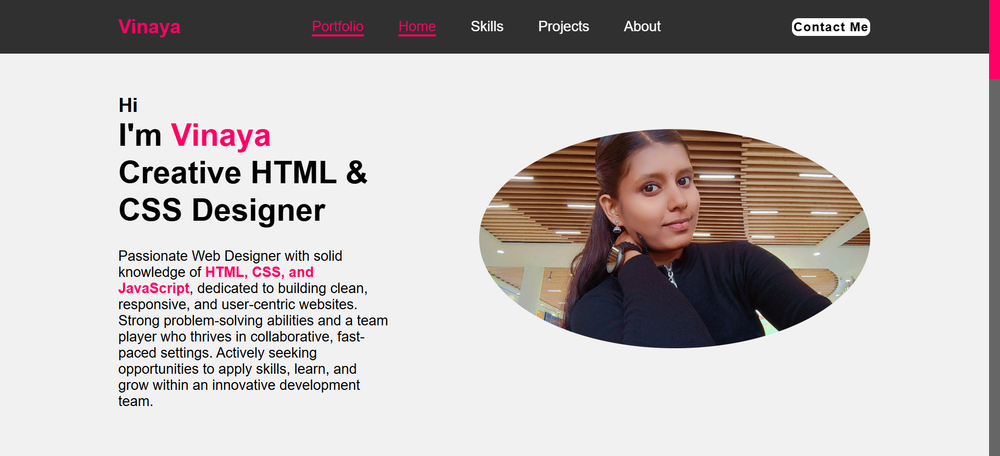

# 💻 Personal Portfolio Website

Welcome to my personal portfolio website, designed to showcase my skills, projects, and journey as a **Creative HTML & CSS Designer**. This site represents not just my work—but *who I am* as a developer and designer.

---

## 📸 Screenshot



---

## 🌟 Key Highlights

- ✨ Minimal, modern, and bold layout
- 🙋‍♀️ "About Me" section with image and intro
- 🔍 Navigation bar with smooth section jumps
- 🎯 Clear personal branding and mission
- 📱 Responsive design for mobile & tablet

---

## 🛠️ Technologies Used

- **HTML5**
- **CSS3**
- **JavaScript**

---

## 📌 Sections Included

- `Home` — Hero banner with self-introduction  
- `Skills` — List of technical strengths  
- `Projects` — Showcasing hands-on works  
- `About` — Who I am & what I do  
- `Contact Me` — Easy way to reach out

---

## 🚀 How to Run Locally

   ```bash

1. Clone the repo:
   git clone https://github.com/vinaya2007/Portfolio.git


2. Navigate to the project folder:
   cd Portfolio

3. Open `index.html` in your browser.
```

## 📬 Contact
📧 vinayavinodh07@gmail.com
📞 +91 90032 80933

## Credits

Built by Vinaya V
